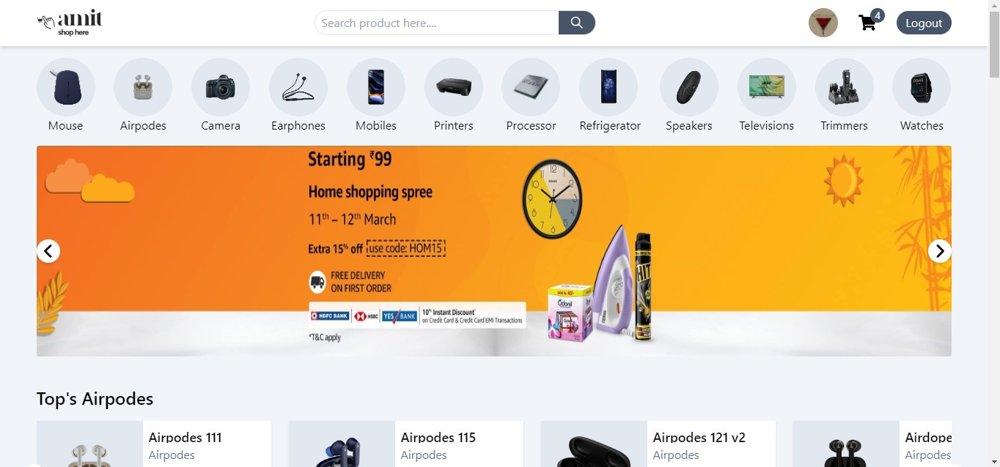
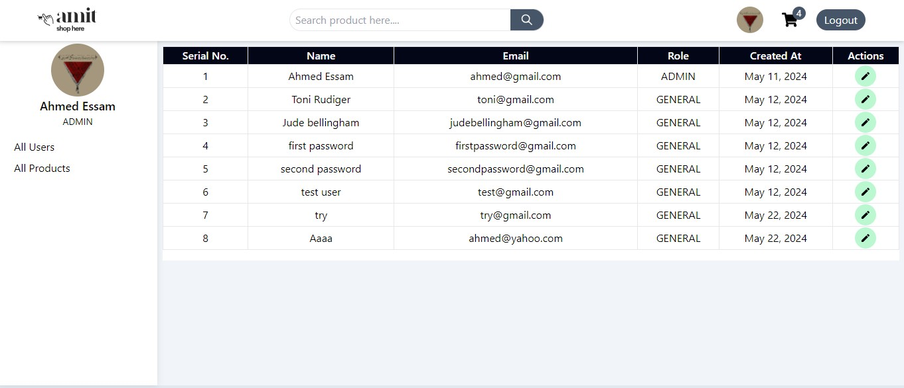
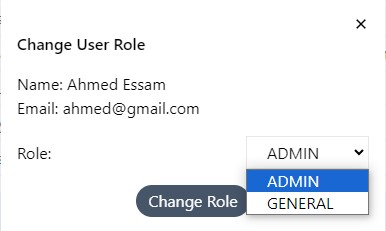
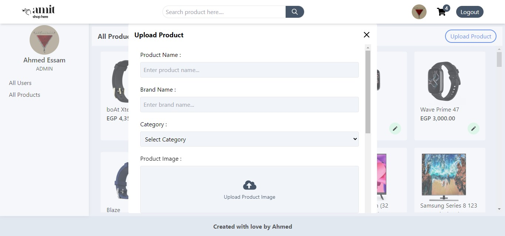
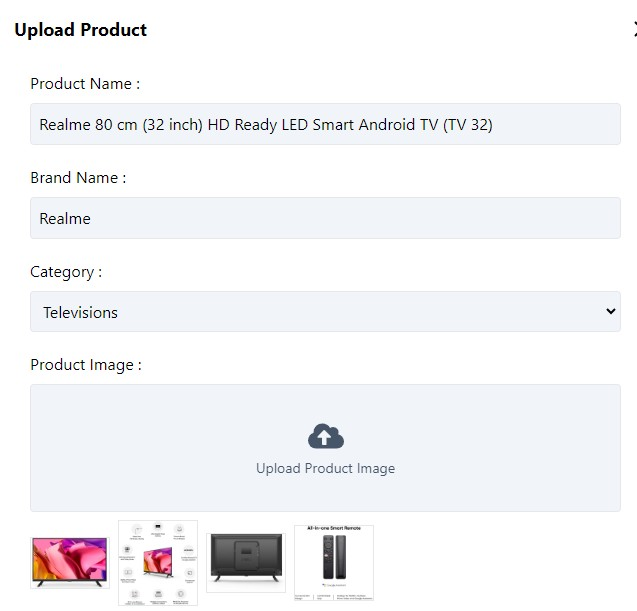
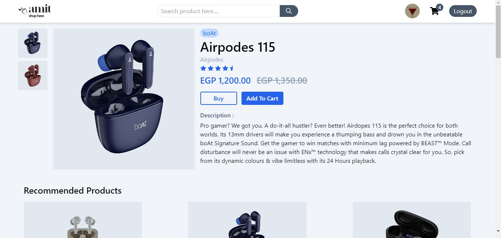
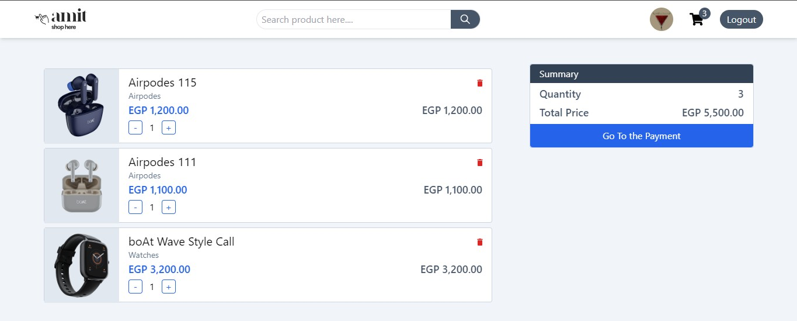
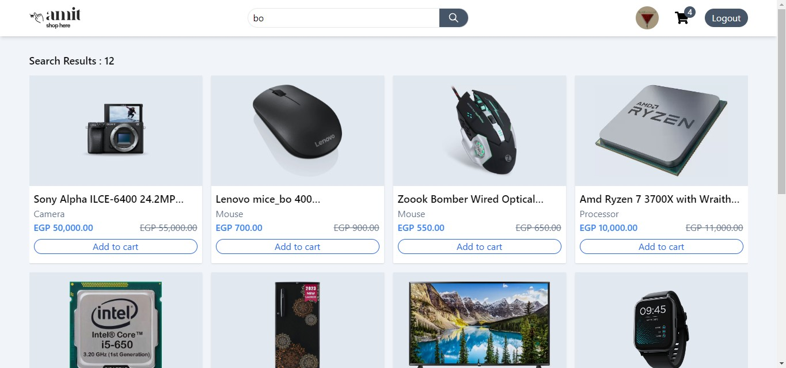

# E-commerce MERN Stack Application

## Project Overview


This project is a comprehensive full-stack E-commerce application developed using the MERN stack (MongoDB, Express.js, React.js, and Node.js). The primary focus of this project is on the front-end development, showcasing advanced React.js skills suitable for a front-end developer position. The application includes user authentication, a dynamic product display, an admin panel for user and product management, and a responsive design for both desktop and mobile views.

## Features

### User Authentication
- **Sign Up and Sign In:** Users can create an account and log in using their credentials. Authentication is connected to an actual backend service.
- **Role-Based Access:** Users can have roles such as "GENERAL" or "ADMIN", with role-specific functionalities.

### Admin Panel (Accessible only to "ADMIN" users on Desktop View)
- **User Management Page:**
  


  - Display a list of users with their email addresses and roles.
  - Change user roles between "GENERAL" and "ADMIN".
    
    


    
- **Product Management Page:**
  - Create new products by entering product details such as name, brand, pricing, selling price, description, images, and category.
    
    


  - Update existing product information.
    
   


  
### Product Display and Category Management
- **Home Page:**
  - Display product cards with details and an "Add to Cart" button.
  - Display a category list. Selecting a category shows the products belonging to that category.
  - Sidebar with checkboxes for categories and radio buttons for sorting products by price (from low to high and vice versa) (Desktop view only).
  -     
   


  
  - Responsive design: Sidebar is hidden on mobile view.
- **Product Detail Page:**
  - Display detailed information about a product, including images, price, and description.
        
   


  
  - Show related products from the same category.

### Cart Functionality
- **Add to Cart:**
  - Logged-in users can add products to their cart.
  - Guests are prompted to log in to add products to their cart.
- **Cart Icon:**
  - Displays the number of products in the user's cart.
  - Clicking the icon shows the cart page with all added products.
- **Cart Page:**
     
   


  
  - Display product cards with options to increase quantity or remove products from the cart.
  - Show a summary card with the net price and total price of all products in the cart.
- **Search bar:**
  - Available to use only on desktop view.
  - Allow the users to search for the products or categories available on the web app.
   
   


  
## Technologies Used

### Front-End
- **React.js**: For building the user interface and managing state.
- **React Router**: For handling navigation between different pages and components.
- **Tailwind CSS**: For presenting a utility first css styles.

### Back-End
- **Node.js**: For server-side JavaScript execution.
- **Express.js**: For building the RESTful API.
- **MongoDB**: For the database, storing user and product information.
- **Mongoose**: For MongoDB object modeling.

### Other Tools and Libraries
- **JWT (JSON Web Tokens)**: For user authentication and authorization.
- **Bcrypt.js**: For hashing passwords.

## Installation and Setup

### Prerequisites
- Node.js and npm installed on your machine.
- MongoDB instance (local or cloud).

### Backend Setup
1. Clone the repository.
   ```sh
   git clone https://github.com/ahmedessam3270/MERN_e-commerce

